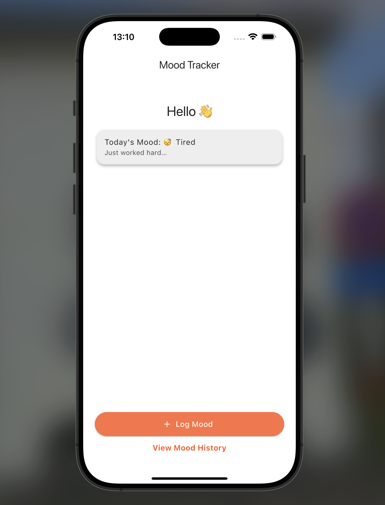
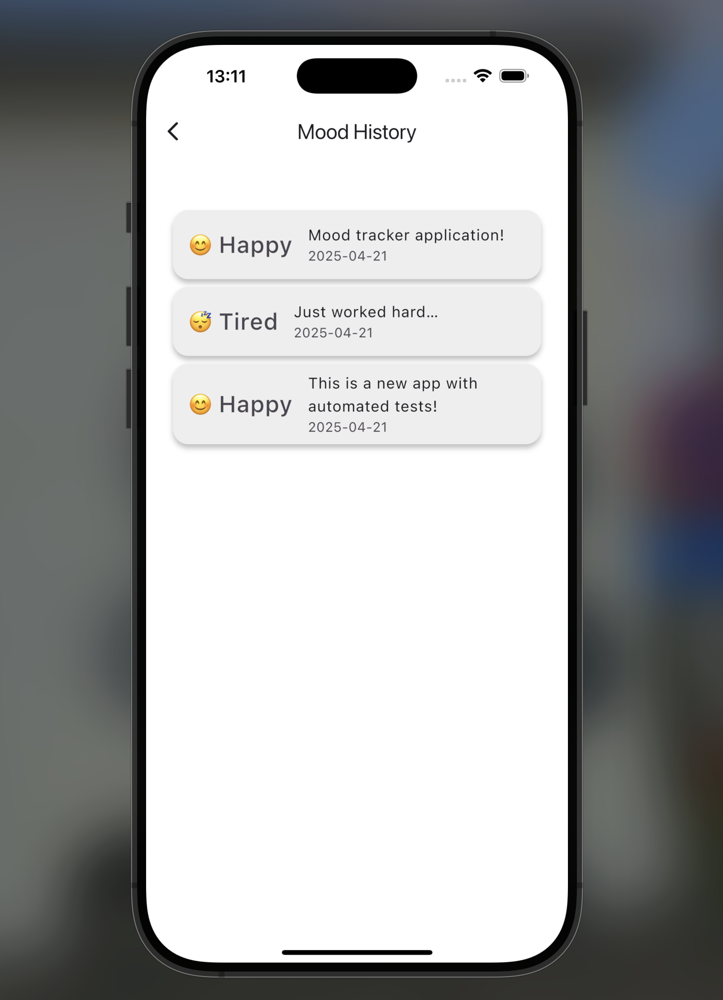
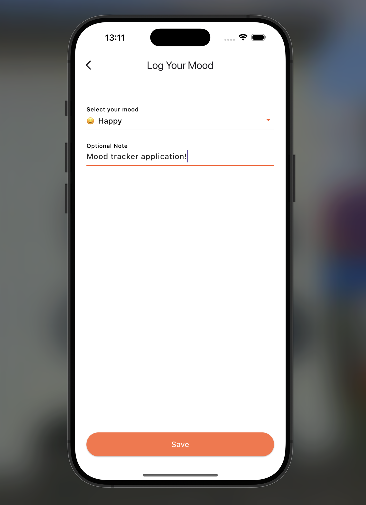
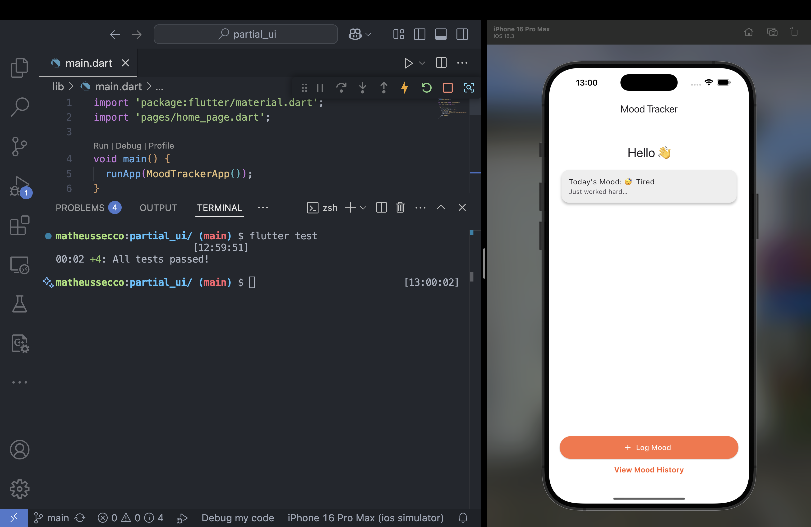

# Partial UI

Repo for the Partial UI with automated tests assignment.

---

## App Screenshots

## Tests

## Running App

You can view a video of the running app [here](screenshots/screen_recording.mp4).